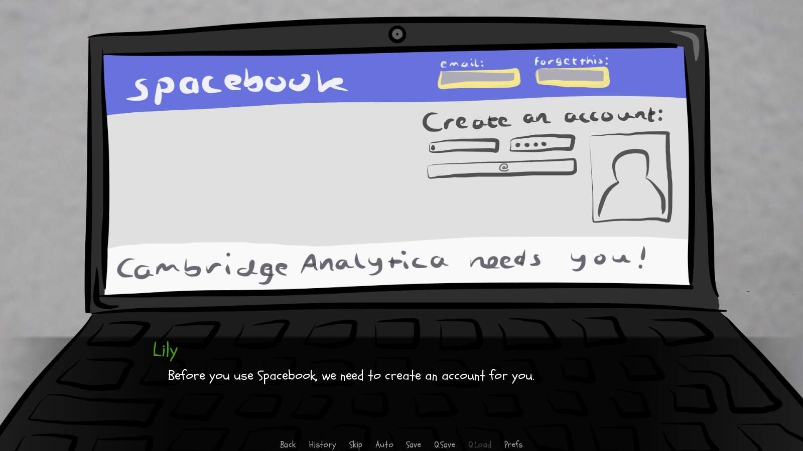

Last week saw the return of Prewired's Summer Hack to CodeBase Edinburgh. The idea is simple: a week where young people can get together to learn about a particular problem set, and build a software (or this year, also hardware) solution to help solve those problems.

21 young people signed up to hear some of the problems around the themes of **Security and Privacy**, pitched by Civic Digits, Skyscanner and Barclays Eagle Labs. We wanted to allow the young people to think about the scope of the projects as broadly as possible &mdash; not just around what their proposed solution was or what language they were going to program in, but about who the end user was and why that was important. These ideas were reinforced throughout the week by micro workshops on project management, version control and presentation skills.

What was incredible was the level of polish the final projects achieved in just a few short days &mdash; from a game that lets you cheat by prompting you to give up personal data (with the soundtrack changing to a minor key the more data you give) to the phenomenally named SKYBorg, a robot concierge to help Doris (92), a teenager who had never travelled alone before or a parent with lots of baggage navigate an airport.

The week went far beyond the outputs &mdash; it was heartening to see the teamwork displayed by young people working with complete strangers, and the inclusivity of all skills. Whether people were coding, creating art assets, composing soundtracks, or thinking about personas, all talents contributed equally. Perhaps due to the theme of the week, this was the first year we saw more in depth thought into topics like ethics - e.g how would the digital products manage your data after you finish with them? These lessons are vital for the next generation of techies to think about.

Summer Hack couldn't happen without the help of some amazing people and organisations, and we'd love to take a moment to thank everyone involved:

All the people that took time to come and volunteer during the week &mdash; you know who you are! [Allan Lloyds](https://www.linkedin.com/in/allanclloyds/) from [Product Forge](https://productforge.io) was instrumental in keeping the week on track; [Airts](https://www.airts.co.uk), Float, Civic Digits and Skyscanner provided prizes and support throughout the week; whilst Sean McGivern from Gitlab taught us all about version control.

## Challenges

The teams all decided to pick one of the following two challenges:

### Cyber Security Challenge (Civic Digits)

Create a game or an app to help someone who doesn’t know or think about cyber security

Imagine someone who never really thinks about cyber security and isn’t aware of any threat online. How could you engage them? What would be the most fun, provocative or interesting way to do either of the following?

* Tell someone something about how to stay safe online
* Encourage them to find out for themselves.

<!-- [Read more...](/summerhack2018/cyber.html) -->

### Robot Airport Assistant (Skyscanner)

Make a Lego robot to guide passengers to different locations in a (mocked-up) airport, help them with their luggage, buy presents to take home, warn when their flight is boarding. Keep a record of who the passengers are and where they are going.

## Team Projects

Five teams created projects during the week &mdash; brief descriptions below.

### Clueless?

Calum, Logan, Reuben, and Gregor

> **Earthbound**: A Mario-type game that incentivizes users to enter private data in order to skip levels and finally warns them of the dangers of disclosing this data. 

[Project code](https://drive.google.com/file/d/1LI8jV3ZFxO_j60yYKfqQBTs8_dh8vr09/view)

### Coffee Cup

Cameron, Cerys and, Ruaridh

> **SKYBorg**: A Mindstorms robot to help elderly / limited-mobility passengers to reach different destinations in an airport.

[Project code](https://github.com/CerysKitten25/coffee-cup)

<!-- [Slides](https://docs.google.com/presentation/d/1xD5xUzQjaOB1LenBphnrT_li2ViJpKnaSLnmxS9zLNM/edit?ts=5b6b0add#slide=id.g3dc3b5a4aa_0_31) -->

### Pythonagoras

Beccie, Christina, and Tom

> **Glitch**: A game that walks users through the process of registering for and using a social media platform in order to highlight the data privacy risks. 

📄[Slides](/projects/sh18_Pythonagoras.pdf)

### Team Rocket

Bruce, Luca, Kiran, and Theo

> **Cyberstrike**: A visual novel, including mini-games, designed to give information about cyber security to an alien from Planet Zorg. Lily shows the alien how to use Google maps and social media to find its friend.
>   
> 

[Project code](https://gitlab.com/brucekly/cyberstrike)

### Experienced Amateurs

Andrew, Charlie, Kenneth, Sandy, and Robert

> **AirBuddy**: A robot assistant that uses line-following and a text-based interface to guide people through an airport.

[Project code](http://gitlab.com/theexperiencedameteurs/projects)

## Awards

### First Prize (Arduino Ultimate Starter Kits, sponsored by Airts):

[Pythonagoras](#pythonagoras)

### Second Prize (micro:bit Project Kits, sponsored by Float):

[Experienced Amateurs](#experienced-amateurs)

### Civic Digits Cyber Security Prize:

[Pythonagoras](#pythonagoras)

### Code Quality Prize:

[Experienced Amateurs](#experienced-amateurs)
