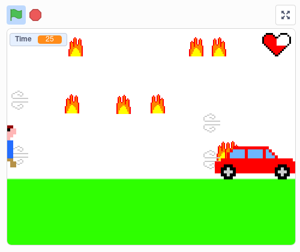
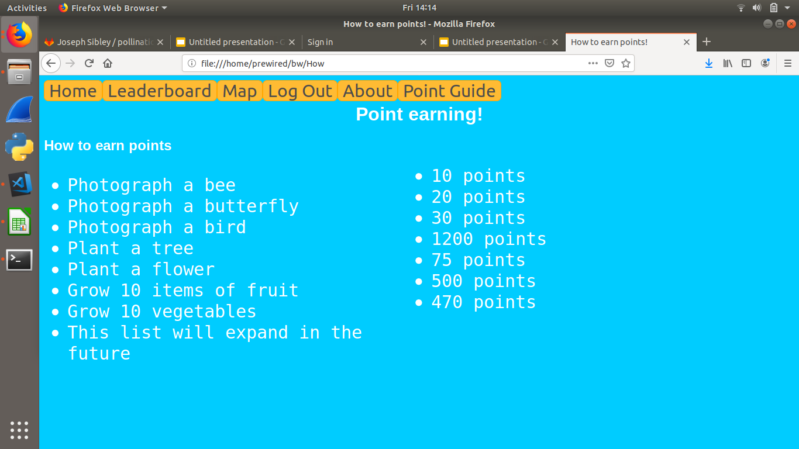
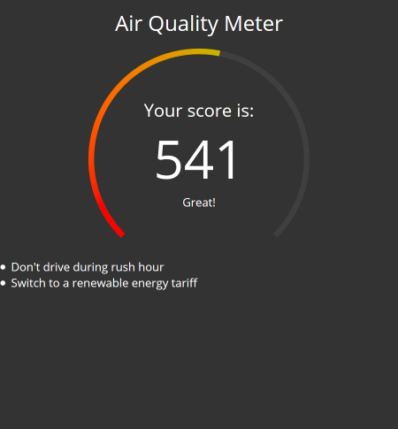
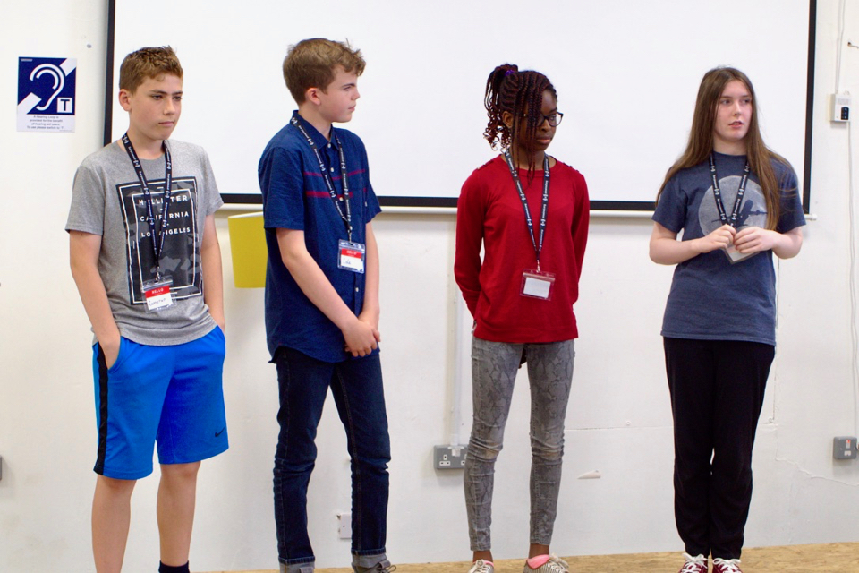
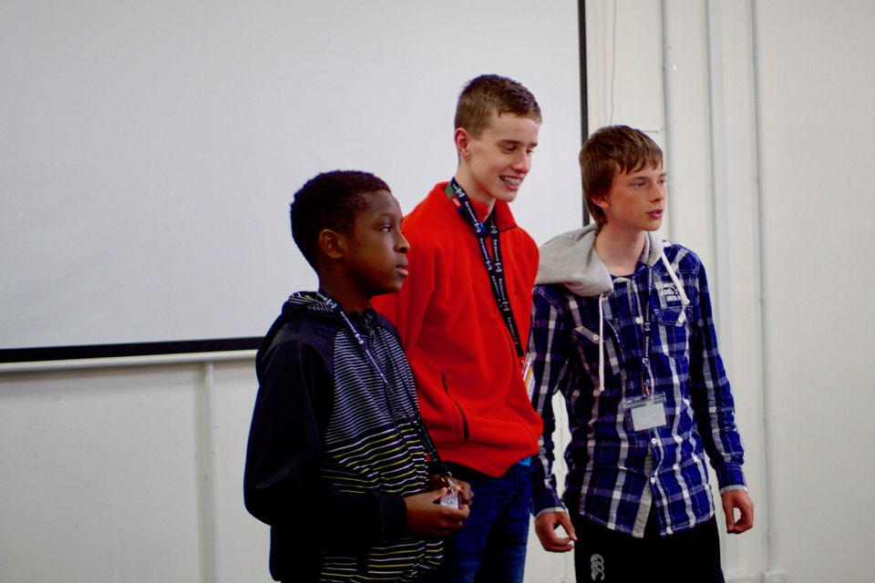

We had an awesomely good Summer Hack 2019! It took place on July 22nd&ndash;26th 2019 at CodeBase, 38 Castle Terrace, Edinburgh.

Five teams created projects during the week &mdash; brief descriptions below.

## Project Descriptions

### The Bugs

Christina, Sarah, Cameron, Cole

> **Green Beans**: A game that uses a restaurant cooking scenario to raise awareness about sustainability and show people how they can reduce greenhouse gas emissions in their everyday lives.
There is also a profit score to make it more realistic and to show how people can protect the environment without damaging their lifestyle.
It is a click-and-drag game, currently with three different meal options and two different upgrades.
>   
> 

Also see their 📄[presentation](/projects/sh19_The_Bugs.pdf).

### [INSERT TEAM NAME HERE]

Andrew, Gregor, Ardal

> **Balance**: A game created with Unity that uses a city management scenario to explore the balance betwwen economic and environmental sustainablity.
>   
> ![\[INSERT TEAM NAME HERE\]](../assets/projects/sh19_insertteamnamehere.png)

### Next Level

Sandy

> **Climate Crisis**: A game created with Scratch which tests the user's environental awareness and increases the level of difficulty in the game accordingly.
>   
> 

### Pollinator World

Joe, Joseph, Joe

> **Pollinator World**: A social media / forum site which awards points to users when they  upload information showing how they have created a wildlife-friendly garden.
>   
> 

### We Have Idea

Kenneth, Fraser, Robert

> **Air Quality Meter**: A responsive web app that allows the user to determine the air quality in the area around their postcode.
>   
> 

## Awards

* **First Prize**: We have Idea
* **Second Prize**: The Bugs
* **Third Prize**: [INSERT TEAM NAME HERE]

## Photos

|  | ![\[INSERT TEAM NAME HERE\]](../assets/photos/sh19_insertteamnamehere.jpg) |  |
| --- | --- | --- |
|  |  |  |

## Summer Hack 2019 Sponsors

We are grateful to our sponsors, who helped make it all possible. And of course a big thanks to CodeBase for hosting us again.

* [Bank of Scotland](https://bankofscotland.co.uk/)
* [Scottish Wildlife Trust](https://scottishwildlifetrust.org.uk/)
* [Product Forge](https://productforge.io/)
