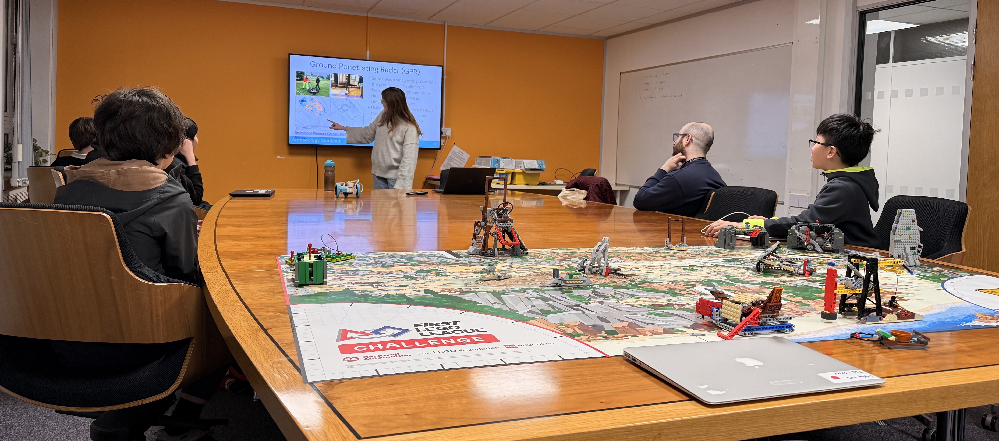

On 11 February, Prewired participated once again in the Edinburgh competition of the FIRST LEGO League Challenge, with two teams! This year's theme, *UNEARTHED*, had us explore the world of archaeology. In weekly sessions, since September, the teams worked on each of the four elements of the competition:

* 🤖 Robot Game: Building and programming a LEGO robot to solve challenges on a game mat
* ⚙️ Robot Design: Delivering a presentation to a panel of judges about how the team designed the LEGO robot
* 💡 Innovation Project: Designing an impactful new technology related to the challenge theme
* 🤝 Core Values: Displaying teamwork, inclusion, impact, innovation, discovery, and fun throughout all activities

Our red team, the **Dale Diorites**, consisted of Angus, Callum, David, and William. Not only did they finish 4th place in the robot competition with a whopping 180 points--they had also coded their entire robot in Python, instead of using block-based programming, for the first time. For their innovation project, they focussed on oxidation, and designed a robot that could drive around archaeological dig sites to preserve and mark excavated objects. Their judges wrote:

> *You articulated your design well and the idea for a dual-axis motion was very innovative. Also, great job starting learning Python from scratch and this will carry well with you in your future.*

Our blue team, the **Groundbreakers**, came almost as close in the robot competition with 175 points in their best attempt. Florian, Jaden, Oscar, Saahir, and Tariq had researched ground-penetrating radars (GPRs) for their project, and presented to the judges an innovative robot that would enhance current systems' capabilities with new AI-based algorithms. They also had--in our definitely unbiased opinions--by far the best team name of the day. The judges noted:

> *You clearly showed pride and enthusiasm - especially in the robot build. You clearly enjoyed working together and it was great to see how you all respected and took on board everyone's ideas.*

We're so proud of both teams!

In working out their projects, the teams received feedback from Calypso Finch from [Archaeology Scotland](https://www.archaeologyscotland.org.uk/), who visited us in January to tell us a bit about her work and listen to the teams' work-in-progress presentations. We saw Calypso again at the competition, where she'd brought some archaeology-related activities for the teams to unwind in-between sessions. Thank you so much for all your support!

A massive thank you also to Catherine Brotherton and her colleagues at Edinburgh College who hosted the tournament again this year and did all the hard work in enabling us to participate.

We hope to be back next year!
