During the weekend of 1 and 2 August 2026, we hosted what is already our **fourth annual Summer Make-a-Thon**! This year, 19 young people from Edinburgh, the Lothians, and Fife joined us for a weekend of teamwork and making, creating technology to support mental health.

The weekend started with a **collaborative brainstorming** session. In random groups, everyone thought about ways in which technology can influence mental health in positive and negative ways, and strategies to keep use of technology healthy. This proved fertile ground for finding a team focus once the participants had formed their teams, leading to the six projects detailed below.

After two long days of work, it became clear that this was easily our **most advanced** Make-a-Thon yet. In terms of technology, a grant from the ASDA Foundation Young Futures Fund had allowed us to acquire new equipment focussed on making the weekend more accessible, including 10 new high-quality headphones, 2 drawing tablets for creative work, and a set of Grove sensors and modules that opened up working with electronics to teams that would never have tried it before. More importantly, however, we felt that this weekend was also our most advanced in terms of *teamwork*. Even though almost everyone had to work intensively with teammates they had never met before, teams worked hard to find an appropriate role for each member and sought out professional collaboration tools such as GitHub to integrate their work.

On Sunday afternoon, each team presented their work to an audience of family members as well as our three judges Michael, Pat, and Vid, who brought their valuable experiences working in mental health and technology for young people. After a difficult deliberation, **team KSJ emerged as the winner**---congratulations again!

Read on for an overview of each project or scroll down to the photo gallery.

## Project descriptions

### 🏆 Team KSJ
KC, Sacha, and Joshua

> **Mental health game**: Rather than building something for people with a particular mental health issue, KSJ decided to focus on raising awareness of mental health issues with the general public. To this end, they built a game in Scratch in which the player explores a town, gets to know its inhabitants and their mental health issues, and helps them out. Read more in their [slides](https://docs.google.com/presentation/d/1wBeuuXq7PTfekYZ6ebO7-Vu-q5-GLxsjYCZhHRrZeJQ/edit?usp=sharing).
>   
> 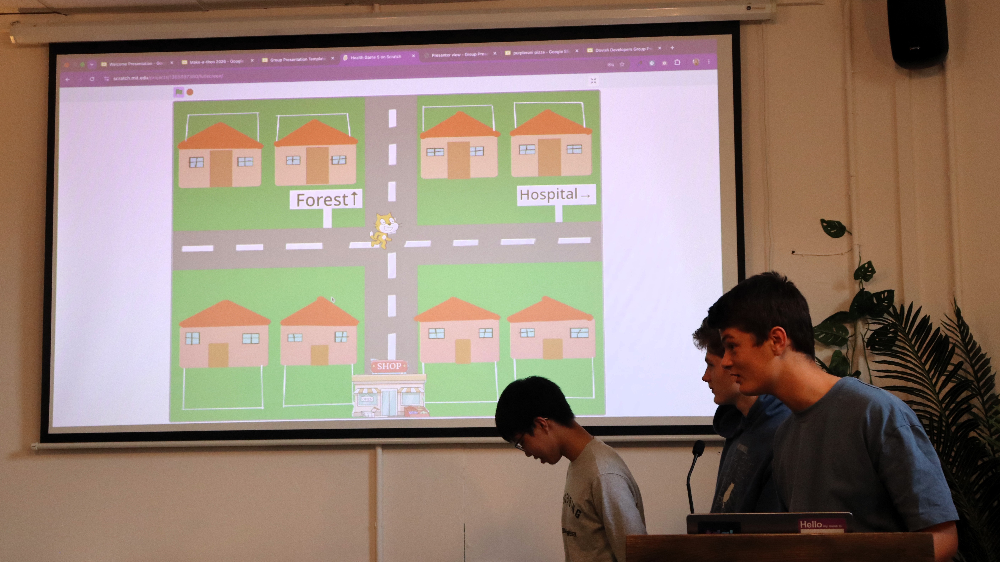

### Purpleroni Pizza
Esben, Darren, Finn, and Ethan

> **Colour detector**: Purpleroni Pizza realised how exclusionary the world can be to people with colour blindness and decided to prototype a device that could help with this. Using LEGO robotics, they built a handheld colour detector that tells its user exactly what it is pointed at. Read more in their [slides](https://docs.google.com/presentation/d/1pt2HJIITJjX5ANa8UOAeW2PUd8Mpzrxkv7vjza47a_E/edit?usp=sharing).
>   
> 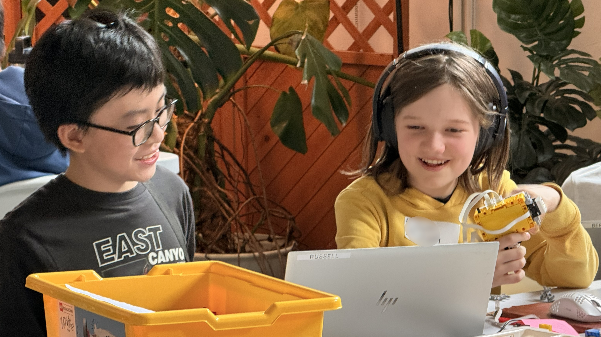

### Fire Exit
Idris, Reuben, and Tariq

> **Desktop Buddy**: The first of two teams to prototype robotic animals, team Fire Exit turned to LEGO robotics enhanced with Grove electronics (including a mini-fan!) to create a small creature that lives on your desk and interacts with its environment. Turn on your sound when watching their [slides](https://docs.google.com/presentation/d/1f9F8fZ1tZ7DoHunru6-4ocs1KjDD1tigQtCC77hISOI/edit?usp=sharing)!
>   
> 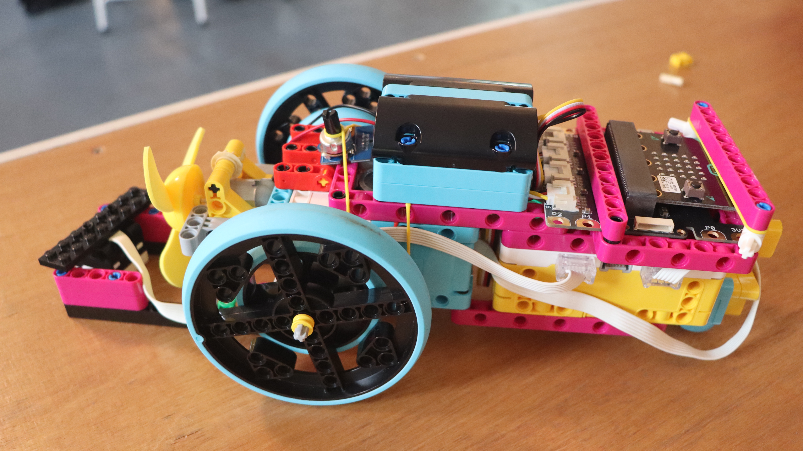

### Team HAC
Harry, Angus, and Callum

> **Robodog**: Taking a different approach, Team HAC set out to create an actual robotic dog. They managed to integrate sensory input from a LEGO EV3 hub running a custom OS with a Raspberry Pi driving LEGO SPIKE motors, exchanging information through Python sockets. Read more in their [slides](https://docs.google.com/presentation/d/1vMWxSMIVQsYdOOsaa4OvHn8SDNSGzExr6QhL3MLSLEE/edit?usp=sharing).
>   
> 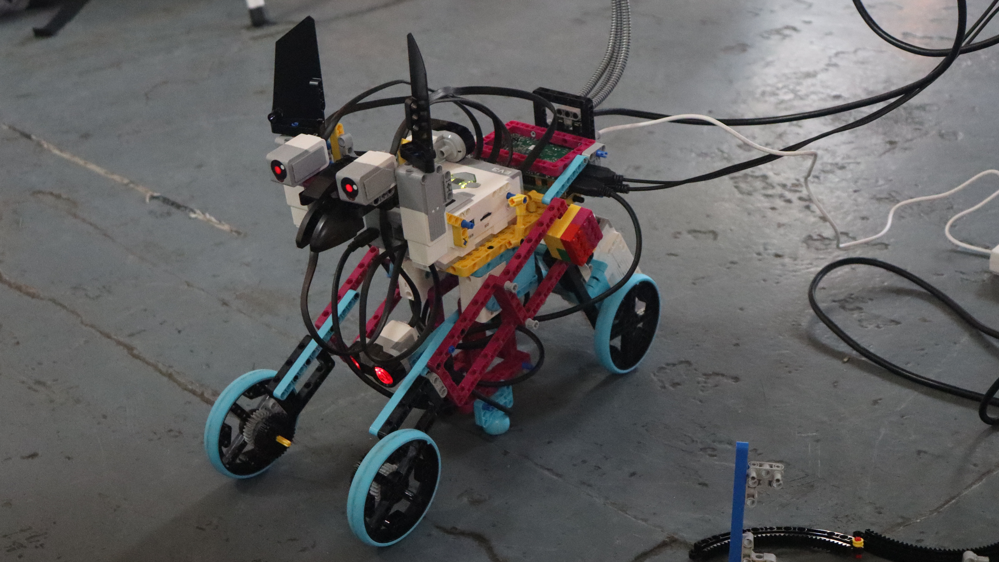

### Dovish Developers
Sam, Thanasis, and Will

> **Calming Driving Sim**: To provide people with a calming experience, the Dovish Developers built an infinite, procedurally generated driving sim in Unity. In between stretches of driving, players can step out of the car to meet NPCs giving inspirational advice alongside the road. Read more in their [slides](https://docs.google.com/presentation/d/12JLH8AXuWkJ7nW29MbePmgtGQy85_hCfqi6A6WYGzqQ/edit?usp=sharing).
>   
> 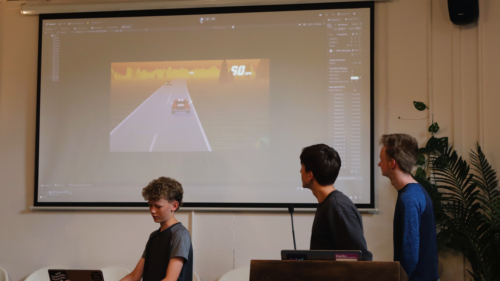

### Daniel

> **Particle Simulator**: Last but not least, there was one solo project. Daniel used his own rendering engine built in Java to create a relaxing experience in which the user can interact with colourful particles. Read more in his [slides](https://docs.google.com/presentation/d/1_uoJAOmDFNUQmBXjXAHnFKB1ATxG7safrLtbC2SvNdg/edit?usp=sharing).
>   
> 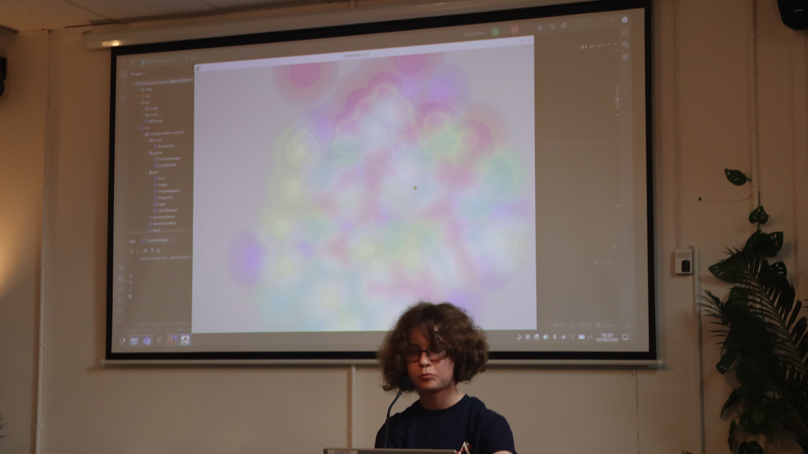

## Gallery

| 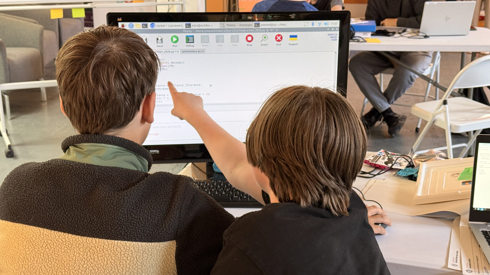 | 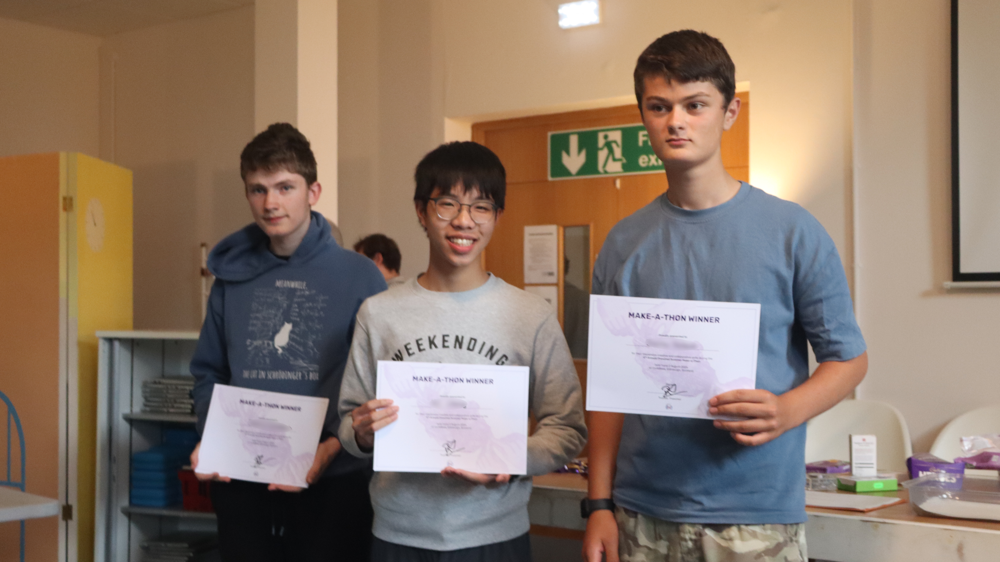 |
| --- | --- |
| 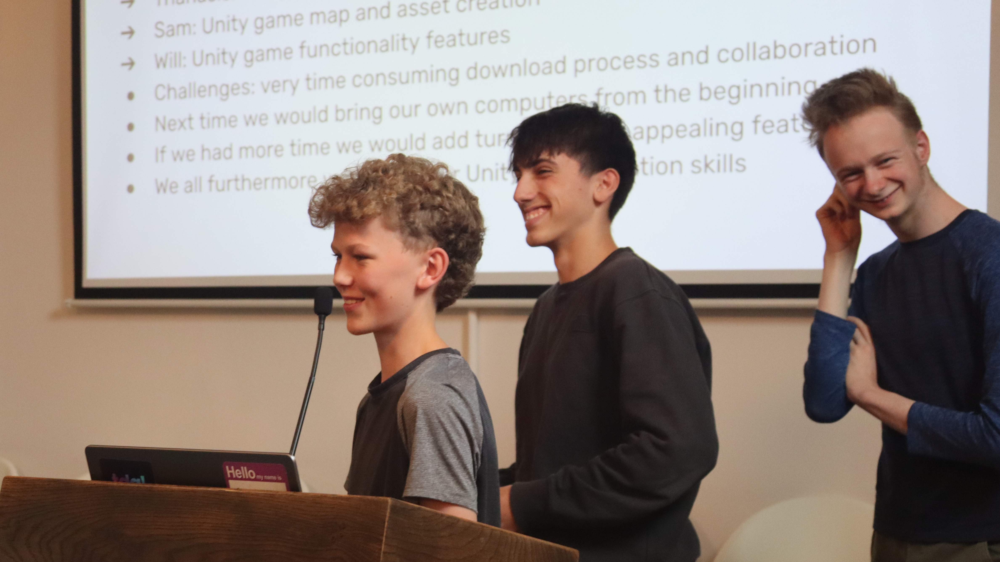 |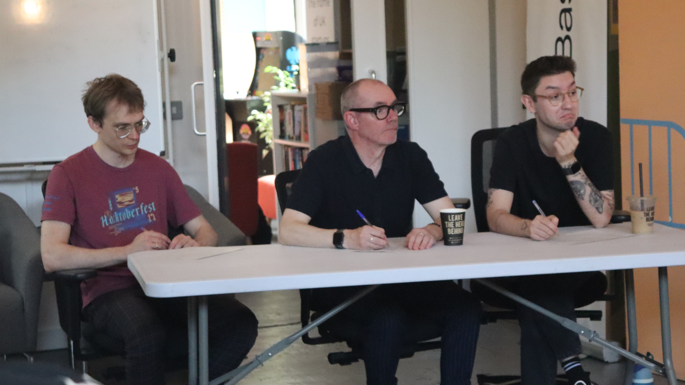 |
| 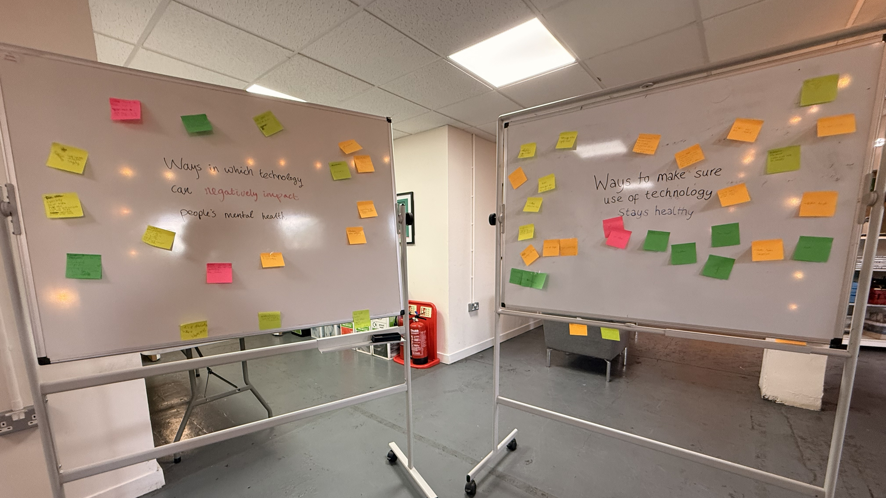 |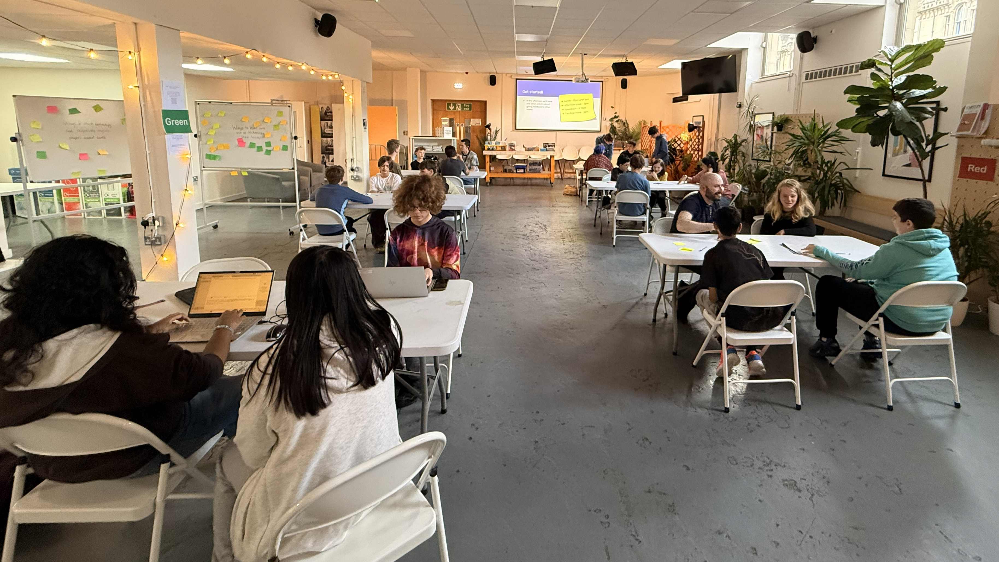 |

  
A massive thank you to everyone who participated or volunteered during the weekend. See you next year!
